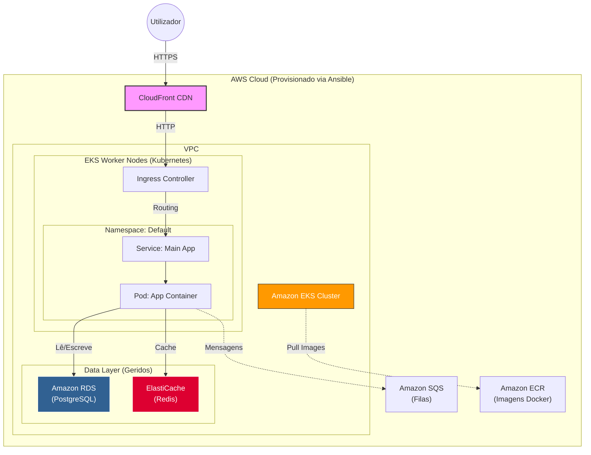

### 📊 Infrastructure Diagram

The following diagram illustrates the interaction between the Kubernetes components and the AWS resources provisioned by the Ansible roles:
---

```mermaid
graph TD
    user((Utilizador))
    
    subgraph "AWS Cloud (Provisionado via Ansible)"
        CF[CloudFront CDN]
        ECR["Amazon ECR<br/>(Imagens Docker)"]
        SQS["Amazon SQS<br/>(Filas)"]
        
        subgraph VPC
            EKS_Control[Amazon EKS Cluster]
            
            subgraph "Data Layer (Geridos)"
                RDS["Amazon RDS<br/>(PostgreSQL)"]
                Redis["ElastiCache<br/>(Redis)"]
            end
            
            subgraph "EKS Worker Nodes (Kubernetes)"
                Ingress[Ingress Controller]
                
                subgraph "Namespace: Default"
                    SvcApp[Service: Main App]
                    PodApp[Pod: App Container]
                end
            end
        end
    end

    %% Fluxo de Tráfego
    user -->|HTTPS| CF
    CF -->|HTTP| Ingress
    Ingress -->|Routing| SvcApp
    SvcApp --> PodApp
    
    %% Dependências da Aplicação
    PodApp -->|Lê/Escreve| RDS
    PodApp -->|Cache| Redis
    PodApp -.->|Mensagens| SQS
    
    %% Deploy
    EKS_Control -.->|Pull Images| ECR
    
    %% Estilos
    style CF fill:#f9f,stroke:#333,stroke-width:2px
    style RDS fill:#316192,stroke:#fff,color:#fff
    style Redis fill:#DD0031,stroke:#fff,color:#fff
    style EKS_Control fill:#FF9900,stroke:#333,color:#fff
```

---
    
